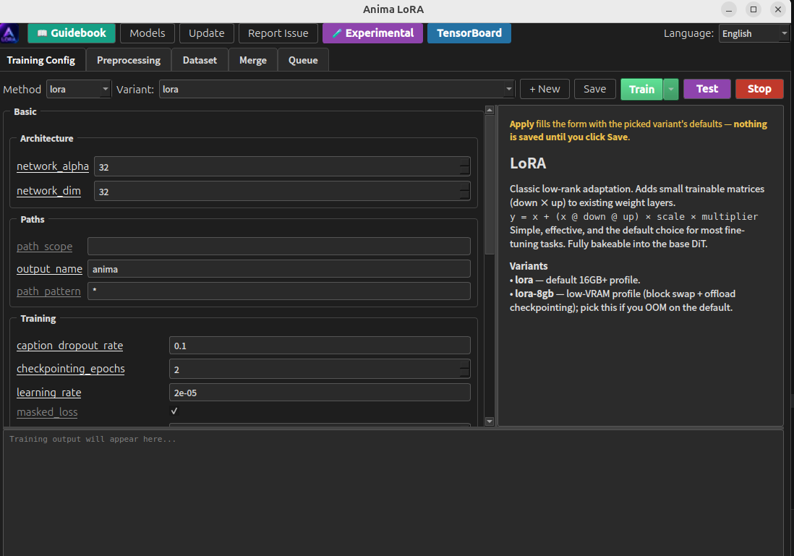

# anima_lora

📖 Guidebook: [English](docs/guidelines/guidebook.md) · [한국어](docs/guidelines/가이드북.md) · [日本語](docs/guidelines/ガイドブック.md) · [中文](docs/guidelines/指南书.md)

<p align="center">
  
</p>

Four things this repo aims to do well:

1. **Fast LoRA training** on consumer GPUs — per-block `torch.compile` over a tiny fixed shape set (one block graph per token-count family), end to end.
2. **Solid conventional implementations** — LoRA, OrthoLoRA, and T-LoRA stack together and bake losslessly into a standalone DiT checkpoint.
3. **Recent methods, engineered for Anima** — Spectrum inference, DCW & SMC-CFG samplers, OrthoHydraLoRA, and modulation guidance, each implemented end-to-end against Anima's compile contract rather than dropped in as a toy port.
4. **A broad experimental surface** — SPD, ChimeraHydra, Soft Tokens, Turbo distillation, ReFT, IP-Adapter, EasyControl, DirectEdit, embedding inversion.

> **At-a-glance diagrams** for every method (DiT internals, LoRA, OrthoLoRA, T-LoRA, HydraLoRA, ReFT, Spectrum, modulation, compile optimizations) live in [`docs/structure_images/`](docs/structure_images/) — paired with prose walkthroughs in [`docs/structure/`](docs/structure/).

## What's new

| Feature | Description | Guide |
|---------|-------------|-------|
| **CAME_C optimizer** | Fused CUDA kernel implementation of CAME — 1.31× faster with 8 custom kernels replacing 35+ ATen ops | [docs/guidelines/came.md](docs/guidelines/came.md) |
| **LoKR** | Low-rank Kronecker product adaptation — structured high-rank with adaptive parameter count | [docs/guidelines/lokr.md](docs/guidelines/lokr.md) |
| **LoHA** | Low-rank Hadamard product adaptation — effective rank r² with only 2× LoRA parameters | [docs/guidelines/loha.md](docs/guidelines/loha.md) |
| **CAME optimizer** | Factorized optimizer replacing full-matrix second moments — significant memory savings | [docs/guidelines/came.md](docs/guidelines/came.md) |
| **Bucket Families** | Resolution bucketing by area → AR matching to token-count groups for compile performance | [docs/guidelines/bucket-families.md](docs/guidelines/bucket-families.md) |
| **Workflow engine** | WebUI + CLI multi-stage training pipeline with real-time progress and schema-driven forms | [docs/guidelines/workflow.md](docs/guidelines/workflow.md) |

---

## How to start

### Quick start — Workflow (recommended)

The easiest way to get started is through the built-in **Workflow engine** — a WebUI + CLI multi-stage training pipeline with real-time progress and schema-driven forms.

```bash
uv sync                   # install dependencies (Python 3.13)
.venv\Scripts\activate    # Windows: enter the virtual environment
# source .venv/bin/activate   # Linux/macOS
python -m workflow        # launch the Workflow WebUI (http://localhost:8765)
```

The Workflow WebUI will guide you through model download, dataset preparation, training, and inference — all from a browser interface.

> Before first use, authenticate with HuggingFace: `hf auth login`

For Workflow usage details, see [docs/guidelines/workflow.md](docs/guidelines/workflow.md).

### Other entry points

<details>
<summary><b>GUI (PySide6 desktop app)</b></summary>

```bash
make gui                  # config editor + dataset browser + training monitor
```
</details>

<details>
<summary><b>CLI (make targets)</b></summary>

```bash
make preprocess           # VAE-compatible resize & validation
make lora                 # or: PRESET=fast_16gb make lora / PRESET=low_vram make lora / make exp-chimera
make test                 # sample generation with the latest trained LoRA
```
</details>

<details>
<summary><b>One-line installer (installs from release)</b></summary>

One line — installs [uv](https://astral.sh/uv) and the **CUDA 13.2 toolkit** if missing, fetches the latest release, runs `uv sync` (Python 3.13 + torch), and on Windows opens the GUI (no git required). The installer is published as a signed-by-checksum release asset:

```bash
# Linux / macOS
curl -LsSf https://github.com/sjmind2/anima_lora/releases/latest/download/install.sh | sh
```
```powershell
# Windows (PowerShell)
irm https://github.com/sjmind2/anima_lora/releases/latest/download/install.ps1 | iex
```

> **Requirements:** at least an Ampere GPU (RTX 3000-series / A100 or newer) + NVIDIA driver **≥595**. The installer sets up the **CUDA 13.2 toolkit, Python 3.13, and PyTorch 2.12** for you.

Installs into `./anima_lora/` (override with `ANIMA_DIR`). On Windows it also drops an **"Anima LoRA GUI"** shortcut on your desktop.

**Reproducible / pinned install** — set `ANIMA_VERSION` to install a specific tag instead of latest:

```bash
ANIMA_VERSION=v1.4.0 sh install.sh       # or: $env:ANIMA_VERSION='v1.4.0'; irm ... | iex
```

On Windows the GUI opens automatically when the installer finishes. **Sign in to Hugging Face and download models right in the GUI** — Hugging Face auth is built in now, so there's no `hf auth login` terminal step. Prefer the CLI? After signing in once (the GUI stores your HF token):

```bash
cd anima_lora
make download-models      # DiT + Qwen3 TE + QwenImage VAE (+ SAM3 / MIT / PE for masking & image conditioning) into models/
make gui                  # config editor + dataset browser + training monitor
```

Update later in place with `make update` (release-tarball merge, no git needed). Prefer cloning the repo? See [Setup → Manual](#manual-from-a-clone).
</details>

---

> **Important: Always use regularization (reg) datasets when training LoRA / LyCORIS.** Training without reg data can cause severe contamination of the base model's capabilities — the adapter may overfit to your training images and degrade the model's generalization (e.g., style bleed, pose lock, loss of quality). Include a reg dataset of diverse general-purpose images to preserve the base model's original behavior. This is especially critical for Anima's DiT architecture.

---

LoRA / T-LoRA training and inference engine for the [Anima](https://huggingface.co/circlestone-labs/Anima) diffusion model (DiT-based, flow-matching).

Four things this repo aims to do well:

1. **Fast LoRA training** on consumer GPUs — per-block `torch.compile` over a tiny fixed shape set (one block graph per token-count family), end to end.
2. **Solid conventional implementations** — LoRA, OrthoLoRA, and T-LoRA stack together and bake losslessly into a standalone DiT checkpoint.
3. **Recent methods, engineered for Anima** — Spectrum inference, DCW & SMC-CFG samplers, OrthoHydraLoRA, and modulation guidance, each implemented end-to-end against Anima's compile contract rather than dropped in as a toy port.
4. **A broad experimental surface** — SPD, ChimeraHydra, Soft Tokens, Turbo distillation, EasyControl, DirectEdit, embedding inversion.

> **At-a-glance diagrams** for every method (DiT internals, LoRA, OrthoLoRA, T-LoRA, HydraLoRA, Spectrum, modulation, compile optimizations) live in [`docs/structure_images/`](docs/structure_images/) — paired with prose walkthroughs in [`docs/structure/`](docs/structure/).

---

## 1. Fast training

**13.4 GB peak VRAM · 1.1 s/step** on a single RTX 5060 Ti while **rank=32 1MP resolution lora training** — achieved by co-designing the data pipeline, attention, and compiler stack so Dynamo sees a tiny fixed set of shapes (one block graph per token-count family) for the whole run.

| Lever | Summary |
|---|---|
| Constant-token bucketing | Buckets fall into two token-count families — 4032 and 4200 patches — each resolution *exactly* filling its count, so there is zero intra-bucket padding. Forwards run at native token counts, so `torch.compile` traces one block graph per distinct count (2). The legacy pad-to-static path was removed (it leaked padding into flash self-attn and couldn't run this table — 4200 > 4096). |
| Max-padded text encoder | Text outputs padded to 512 and zero-filled — the pretrained DiT uses zero keys as cross-attn sinks, so trimming breaks it. Also gives the compiler another fixed dim. |
| Per-block `torch.compile` | Each DiT block compiled independently with Inductor (`compile_blocks()`). Combined with native-token bucketing this pins the trace to 2 block graphs and eliminates guard recompilation. |
| Compile-friendly hot path | Audited every forward for patterns dynamo can't trace cleanly — `einops.rearrange` replaced with explicit `.unflatten()/.permute()` chains, `torch.autocast` context managers replaced with direct `.to(dtype)` casts, dict `.items()` loops hoisted out of compiled regions, FA4 wrapped in `@torch.compiler.disable` for clean graph breaks. |
| Flash Attention 2 | `flash_attn` 2.x with SDPA fallback. FA4 evaluated and removed — see [fa4.md](docs/optimizations/fa4.md). |

Compile pipeline details in [docs/optimizations/for_compile.md](docs/optimizations/for_compile.md).

### Bucket families — detail vs. speed trade-off

Anima's `CONSTANT_TOKEN_BUCKETS` table groups resolutions into **token-count (TC) families** — each family has a fixed patch-grid area so `torch.compile` traces exactly one block graph per family. Smaller TC families train faster (fewer patches per step) but sacrifice fine detail; larger families preserve more spatial information at the cost of compute and VRAM.

| Family | Token count | Max resolution | Use case |
|--------|-------------|----------------|----------|
| XS | 1680 | 640×672 | Fastest iteration, low detail (face/pose experiments) |
| S | 2160 | 720×768 | Quick drafts, small datasets |
| M | 3600 | 960×960 | Balanced quality / speed for most characters |
| L | 4032 | 1008×1024 | High detail, near-square aspect |
| S1 | 1024 | 512×512 | Small square, extreme low-VRAM |
| S2 | 4096 | 1024×1024 | Full 1MP square, max detail |
| XL | 5040 | 1120×1152 | Max detail, widest aspect range |

Select via `bucket_families` in config (e.g. `bucket_families = ["S2"]` for 1024²-only training). Mixing families from different TC groups is supported — each additional TC family adds one compiled block graph. For best compile cache-hit rates, stick to a single TC family.

### Gradient checkpointing — VRAM vs. speed trade-off

Gradient checkpointing (GC) trades compute for VRAM: instead of keeping all forward activations for backward, it discards them and recomputes during the backward pass. Three knobs control this trade-off:

| Setting | VRAM | Speed | Best for |
|---------|------|-------|----------|
| GC off | ~32 GB at 1024² bs=4 | Fastest (no recompute) | 24 GB+ GPUs without memory pressure |
| Full GC (`last_n=0`) | ~8–10 GB | ~1.7× slower (all 28 blocks recompute) | Tight VRAM, large batch or resolution |
| Selective GC (`last_n=N`) | Scales with N (fewer checkpoints = more VRAM) | Faster than full GC (fewer blocks recompute) | Balancing speed and VRAM headroom |
| **GC + SAC** | Full GC + ~2–4 GB extra | 15–25% faster than standard GC | **Recommended** for GC-enabled training |

**SAC (Selective Activation Checkpointing)** uses PyTorch 2.12's `CheckpointPolicy` to save expensive attention operations (flash attention, softmax) and recompute only cheap operations (LayerNorm, element-wise, linear projections) during backward. This eliminates the most expensive part of recompute while keeping the activation memory increase modest. Enable with `gradient_checkpointing_sac = true` in config (requires `torch_compile = true`).

**`last_n` parameter** — when set to a value > 0, only the last N DiT blocks (closest to the output layer) use checkpointing; the remaining blocks run normally. Since `last_n=0` means "checkpoint ALL blocks" (maximum VRAM savings), it is the most aggressive GC setting. Reducing `last_n` (e.g. to 20–22) progressively trades VRAM for speed by removing early blocks from checkpointing. The optimal value depends on your VRAM budget — start high (e.g. `last_n=22`) and increase toward 0 only if you encounter OOM.

### Performance tuning — GPU utilization and baselines

Smaller TC families underutilize high-end GPUs. For example, on an RTX 5090 the S1 family (TC=1024) only sustains 62–69% GPU utilization at `bs=4` — the compute is too light to saturate the GPU. In this case, **increasing batch size** is the most effective lever: it raises GPU utilization without changing per-sample compute. However, larger batches consume more VRAM, so you may need to balance `batch_size` / GC / SAC / `last_n` together to keep the GPU fully fed while minimizing overhead.

**Performance baselines** (RTX 5090, LoKR dim/alpha=16/8 factor=8, CAME_C):

| Config | TC | bs | s/step | s/sample | Notes |
|--------|-----|-----|--------|----------|-------|
| S1 | 1024 | 4 | ~0.4 | ~0.10 | Near theoretical limit for this TC |
| S2 | 4096 | 1 | ~0.42 | ~0.42 | Compute scales linearly: 4096/1024 ≈ 0.42/0.10 |

At `bs=4` with S1, each step processes 4 samples in ~0.4 s, yielding ~0.1 s/sample — essentially the compute floor. S2 at `bs=1` processes 1 sample per step with 4× the token count, so per-sample time rises to ~0.42 s, consistent with the 4096/1024 compute ratio. Both are near their respective performance ceilings.

**CAME_C vs fused AdamW** — CAME_C has a millisecond-level overhead per step compared to fused AdamW, but this is negligible above ~0.1 s/step (sub-1% of step time).

**Numerical accuracy** — CAME/CAME_C may accumulate ~1e-5 error over 15k steps compared to AdamW. Enabling SAC adds ~1e-5 additional error. Both are within acceptable tolerance for LoRA training and have limited practical impact on final model quality.

---

## 2. Solid conventional implementations

The default training config stacks **LoRA + OrthoLoRA + T-LoRA** together. All three fold losslessly into a standalone DiT checkpoint via thin-SVD export at save time, so you can ship ComfyUI-compatible `*_merged.safetensors` with no adapter loader dependency.

| Variant | Pitch | Details |
|---|---|---|
| **LoRA** | Classic low-rank, rank 16–32. | — |
| **OrthoLoRA** | SVD-parameterized with orthogonality regularization; exports as plain LoRA. | [psoft-integrated-ortholora.md](docs/methods/psoft-integrated-ortholora.md) |
| **T-LoRA** | Timestep-dependent rank masking — low rank at high noise, full rank at low noise. Training-only mask, so merge is bit-equivalent. | [timestep_mask.md](docs/methods/timestep_mask.md) |

**Side-by-side** — same prompt, `er_sde` 30 steps, `cfg=4.0`, 1024². Each LoRA trained at rank 16 for 2 epochs on a 20% subset with training seed 42; inference seeds `{41, 42, 43}`. Reproduce with `python _archive/bench_methods.py`.

|  | **LoRA** | **OrthoLoRA + T-LoRA** |
|:---:|:---:|:---:|
| seed 41 |  |  |
| seed 42 |  |  |
| seed 43 |  |  |

<details>
<summary>Base model and individual variants (plain, OrthoLoRA, T-LoRA)</summary>

|  | **plain (base)** | **OrthoLoRA** | **T-LoRA** |
|:---:|:---:|:---:|:---:|
| seed 41 |  |  |  |
| seed 42 |  |  |  |
| seed 43 |  |  |  |

</details>

**Merging**:

```bash
make merge                                  # bake latest LoRA at multiplier 1.0
make merge ADAPTER_DIR=output/ckpt MULTIPLIER=0.8
```

Refuses non-linear-delta variants (HydraLoRA `_moe`) by default; `--allow-partial` drops those and bakes only the LoRA portion.

---

## 3. Recent methods, engineered for Anima

Five recent papers picked up, implemented against Anima end-to-end, and shipped with the engineering they need to be actually usable — not toy reimplementations.

| Method | What it is | Engineering notes | Doc |
|---|---|---|---|
| **Spectrum inference** | Training-free speedup via Chebyshev polynomial feature forecasting (Han et al., CVPR 2026) — ≈1.75× at default settings, up to ~5× on more aggressive schedules (quality tradeoff). On cached steps every transformer block is skipped — only `t_embedder` + `final_layer` + `unpatchify` run. | `register_forward_pre_hook` on `final_layer` captures block outputs without monkey-patching the model; adaptive window schedule concentrates real forwards on early high-noise steps. Stable ComfyUI node in a separate repo: [ComfyUI-Spectrum-KSampler](https://github.com/sorryhyun/ComfyUI-Spectrum-KSampler). | [spectrum.md](docs/inference/spectrum.md) |
| **DCW calibrator** | Sampler-level SNR-t bias correction (Yu et al., CVPR 2026) — mixes each Euler step's `prev_sample` toward the model's `x0_pred` along the LL Haar band. Two modes: scalar `λ` (offline-tuned) and **v4 learnable** per-prompt calibrator with online observation. | v4 head conditions on `(aspect, prompt, observed prefix gap)` and fires after `k=7` warmup steps. Bias direction characterized as **(CFG × aspect)-dependent** on Anima — paper-direction at CFG=4 non-square, paper-opposite at CFG=1 / 1024². Trained per-checkpoint via `make dcw`. | [dcw.md](docs/inference/dcw.md) |
| **SMC-CFG** | Training-free sliding-mode CFG correction in velocity space (Wang et al., CFG-Ctrl) — treats the cond/uncond combine as a control problem applied to the residual `e = v_cond − v_uncond`. No extra DiT forwards. | Ships the **α-adaptive variant**: the paper's fixed gain `k` (≈14× off on Anima at CFG=4, visibly chattering) is replaced with `k_t = α·mean(\|e_t\|)` per step. `make test-smc-cfg` (λ=5, α=0.2); composes with Spectrum and mod-guidance. | [smc_cfg.md](docs/inference/smc_cfg.md) |
| **OrthoHydraLoRA** | MoE-style multi-head LoRA with orthogonalized experts and layer-local routing — shared `lora_down`, per-expert `lora_up_i`, learned per-sample router. Targets multi-style training without the cross-style bleed a single low-rank subspace produces. Original paper: [arXiv:2605.03252](https://arxiv.org/abs/2605.03252). | Saves two side-by-side files: `anima_hydra.safetensors` (baked-down LoRA, ComfyUI drop-in) and `anima_hydra_moe.safetensors` (full multi-head). Live routing in ComfyUI via the bundled **Anima Adapter Loader** node (`https://github.com/sorryhyun/ComfyUI-Anima_lora-Adapter`), which installs per-Linear forward hooks reproducing `HydraLoRAModule.forward`. | [hydra-lora.md](docs/methods/hydra-lora.md) |
| **Modulation guidance** | Distill a `pooled_text_proj` MLP that steers AdaLN modulation coefficients toward quality-positive directions (Starodubcev et al., ICLR 2026). Teacher sees real cross-attention; student sees zeroed cross-attention but receives pooled text through modulation. | Trained with `make distill-mod` against the frozen DiT. Inference applies the projection at AdaLN time so it composes with any LoRA variant; `make test MOD=1` runs a sample with it enabled (composes with `SPECTRUM=1`). | [mod-guidance.md](docs/inference/mod-guidance.md) |

---

## 4. Experimental surface

Each ships with a doc — see the link for usage, flags, and caveats.

| Feature | What it is | Doc |
|---|---|---|
| **SPD** | Spectral Progressive Diffusion (Xiao et al., 2026) — training-free multi-resolution inference (`--spd`): run early noise-dominated steps at low resolution, then inject high-frequency detail via spectral noise expansion. Optional trajectory-adapter fine-tune (`make exp-spd`). | [spd.md](docs/inference/spd.md) |
| **ChimeraHydra** | Dual-pool additive MoE: a content pool (layer-local router) plus a frequency pool (network router on FEI + σ features), each an asymmetric HydraLoRA off a disjoint SVD subspace. Fuses HydraLoRA + TimeStep Master + FeRA. `make exp-chimera`. | [chimera-hydra.md](docs/experimental/chimera-hydra.md) |
| **Soft Tokens** | SoftREPA (Lee et al., NeurIPS 2025) — per-layer × per-t learnable text tokens (~1M params) spliced into `crossattn_emb`; DiT frozen. `make exp-soft-tokens`. | [soft_tokens.md](docs/experimental/soft_tokens.md) |
| **Turbo** | DP-DMD distillation (Wu et al., arXiv:2602.03139) of the CFG=4 teacher into a few-step generator. Output is a normal LoRA — infer with `--infer_steps 2 --cfg 1.0`. `make exp-turbo`. | [dpdmd.md](docs/experimental/dpdmd.md) |
| **DirectEdit** | Flow-inversion image editing (Yang & Ye, 2026) — invert to noise, swap edit conditioning, re-denoise with V-injection. Source captions come from the **Anima Tagger** (image → Anima-format tags). `make exp-test-directedit`. | [directedit_editing_v3.md](docs/experimental/directedit_editing_v3.md) |
| **EasyControl** | Extended self-attention image conditioning. DiT frozen; trains per-block cond LoRA on self-attn + FFN + scalar `b_cond` gate. | [easycontrol.md](docs/experimental/easycontrol.md) |
| **Embedding inversion** | Optimize a text embedding to match a target image through the frozen DiT. | [invert.md](docs/inference/invert.md) |

> **Want to contribute?** An area where outside help would have outsized impact: **EasyControl adapters** (canny / depth / pose / … — each control type is one self-contained PR). See [CONTRIBUTING.md → Priority areas](CONTRIBUTING.md#priority-areas).

---

## Setup

> Quick one-line install is up top in [How to start](#how-to-start). The manual clone path is below.

### Manual (from a clone)

```bash
uv sync                   # Python 3.13 with pre-built flash attention 2
hf auth login             # or just sign in from the GUI — auth is built in now
make download-models      # DiT + Qwen3 TE + QwenImage VAE (+ SAM3 / MIT / PE for masking & image conditioning) into models/
# place training images in image_dataset/ with .txt caption sidecars
make gui                  # recommended — config editor + dataset browser + training monitor
```

`uv sync` resolves to **torch 2.12 + CUDA 13.2** runtime. The manual clone path does **not** auto-install the CUDA 13.2 **toolkit** (needed for `torch.compile`/Triton) — install it per [guidebook §2](docs/guidelines/guidebook.md#2-cuda-132-handled-by-the-installer), or just run the one-line installer above, which does it for you.

> **Anima ships as a uv-locked application environment, not a generic pip package.** `pyproject.toml` pins `python ==3.13.*`, specific torch / flash-attn wheel URLs, and `index-strategy = "unsafe-best-match"` — these are maintainer-chosen, known-good builds. Install with `uv sync` against the committed `uv.lock`; don't `pip install` from `pyproject.toml` (pip won't honor uv's index strategy or the prebuilt flash-attn wheels).

CLI path:

```bash
make preprocess           # VAE-compatible resize & validation
make lora                 # or: PRESET=fast_16gb make lora / PRESET=low_vram make lora / make exp-chimera
make test                 # sample generation with the latest trained LoRA
```

Config chain: `configs/base.toml → configs/presets.toml[<preset>] → configs/methods/<method>.toml → CLI args`. Override with `PRESET=low_vram make lora` or `--network_dim 32 --max_train_epochs 64`. Full flag reference in [docs/guidelines/training.md](docs/guidelines/training.md) and [docs/guidelines/inference.md](docs/guidelines/inference.md).

---

## Documentation

| Doc | Contents |
|-----|----------|
| [guidelines/training.md](docs/guidelines/training.md) | Training flags, LoRA variants, caption shuffle, masked loss, dataset config |
| [guidelines/inference.md](docs/guidelines/inference.md) | Inference flags, P-GRAFT, prompt files, LoRA format conversion |
| [optimizations/](docs/optimizations/) | Compile pipeline, FA4 post-mortem, CUDA 13.2 |
| [methods/](docs/methods/) | One doc per method — HydraLoRA, Spectrum, inversion, mod guidance, T-LoRA, OrthoLoRA |

---

## License

Toolkit code: [MIT](LICENSE).

Portions of this toolkit are **derived from [kohya-ss/sd-scripts](https://github.com/kohya-ss/sd-scripts)**, which is licensed under the **Apache License, Version 2.0**. Those portions remain governed by Apache 2.0 — the full license text is in [LICENSE-APACHE](LICENSE-APACHE), and attribution plus a statement of modifications is in [NOTICE](NOTICE). Thanks to kohya-ss and the sd-scripts contributors for their foundational work.

Anima / CircleStone **base model weights** ship under the **CircleStone Labs Non-Commercial License v1.0** and are not relicensed by this repo. Any LoRA, fine-tune, or merged checkpoint trained from those weights is a Derivative and inherits the non-commercial terms. See [NOTICE](NOTICE).
