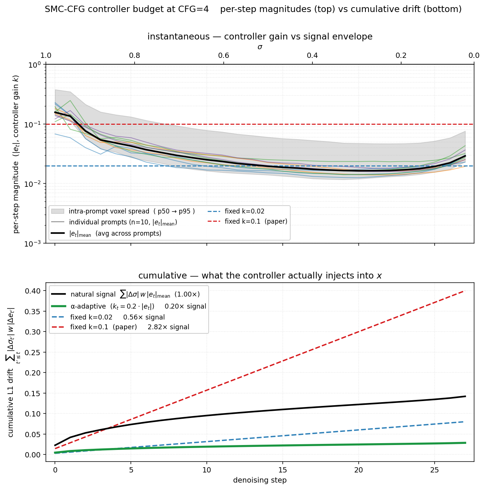

# SMC-CFG — Sliding-Mode Control CFG (α-adaptive variant)

Training-free, sampler-level modification of the CFG cond/uncond combine. Treats CFG as a control problem and applies classical sliding-mode control to the velocity-space residual `e = v_cond − v_uncond`. No extra DiT forwards; one velocity-shaped buffer of state.

Paper: [Wang et al., "CFG-Ctrl: Control-Based Classifier-Free Diffusion Guidance"](https://arxiv.org/abs/2603.03281)

This implementation is the **α-adaptive variant** of the paper — the fixed switching gain `k` is replaced with `k_t = α · mean(|e_t|)` per step (cf. Plestan et al. 2010, adaptive sliding-mode control). The paper's fixed `k=0.1` was empirically off by ~14× on Anima at CFG=4 (see `bench/smc_cfg/analysis_and_proposal.md` §A) and produced visible chattering; the α form self-scales across model / CFG / σ / sample.

## Quick start

```bash
make test-smc-cfg            # latest LoRA + SMC-CFG (λ=5, α=0.2)
SPECTRUM=1 make test-smc-cfg # Spectrum + SMC-CFG composed
MOD=1 make test-smc-cfg      # Mod-guidance + SMC-CFG composed
```

Or add `--smc_cfg` to any `inference.py` invocation:

```bash
python inference.py --smc_cfg \
    --smc_cfg_lambda 5.0 --smc_cfg_alpha 0.2 \
    ...  # other inference args
```

## How it works

At each denoising step, given cond/uncond velocities and the CFG scale `w`:

```
e_t        = v_cond − v_uncond              # semantic error (velocity-space)
s_t        = (e_t − e_prev) + λ · e_prev    # sliding-mode surface
k_t        = α · mean(|e_t|)                # adaptive switching gain
Δe         = −k_t · sign(s_t)               # bang-bang correction
v̂_t        = v_uncond + w · (e_t + Δe)      # modified CFG combine
```

`e_prev` is the **uncontrolled** `e` from the previous step (initialized to `e_t` on the first step), so the sliding surface tracks the real cond/uncond discrepancy rather than the controller's own feedback.

### What the sliding surface does

With `λ > 0` and `e` slowly varying (typical on Anima — semantic content stabilizes early), `s_t ≈ (1+λ)·e_t`, so `sign(s_t) ≈ sign(e_t)`. The per-step correction becomes:

```
Δe ≈ −k_t · sign(e_t)
```

This subtracts a **constant-magnitude offset along sign(e_t)** in every voxel — independent of `|e_t|` per voxel. So:

- **High-|e| directions** (clear semantic moves: structure, fingers, detail): barely affected in relative terms → reconstruct cleanly.
- **Low-|e| directions** (small per-voxel CFG corrections — typically DC-like channel biases): get fully clamped or sign-flipped.

The effect is "denoising CFG itself" — suppress small/noisy CFG corrections, preserve big confident ones.

### Why α-adaptive instead of fixed k

The bench measurement (`bench/smc_cfg/measure_error_magnitude.py`, summary in `analysis_and_proposal.md`) shows `mean(|e_t|)` on Anima at CFG=4 is roughly two orders of magnitude smaller than what the paper's fixed `k=0.1` assumes. Concretely, the paper's value over-injects the correction by ~14× and produces visible texture noise.

The α-adaptive form `k_t = α · mean(|e_t|)` keeps the controller in-band by construction — it scales with the natural magnitude of the residual the controller is operating on. α=0.2 (the production default) puts the correction at ~20% of the average residual magnitude per step, which is enough to clamp small-|e| noise without disturbing large-|e| structure.



The top panel makes the instantaneous mismatch visible: in the σ ≈ 0.2–0.4 plateau the signal envelope drops to `|e_t|.mean ≈ 0.02`, while paper-k = 0.1 sits an order of magnitude above it. The bottom panel integrates that mismatch across the 28-step Euler schedule using the SMC switching term's per-voxel L1 contribution `Σ |Δσ_t| · w · |Δe_t|`:

- **black** — natural CFG signal `Σ |Δσ| · w · |e_t|.mean`, i.e. how much the prompt conditioning displaces `x` away from `v_uncond` over the trajectory.
- **green** — α-adaptive controller. By construction `k_t = α·|e_t|.mean`, so its cumulative budget is exactly `α × signal` (0.20× here) at every step. Always in the refining zone.
- **blue / red** — fixed k = 0.02 / 0.1. `k` doesn't see `|e|`, so the curve grows linearly with `Σ|Δσ|`. Paper-k = 0.1 ends at **2.82× the natural signal** — and because `sign(s) ≈ sign(e_prev) ≈ sign(e)` under λ=5, that "extra magnitude" is an *anti-prompt* drift, not extra signal. The controller spends most of the trajectory clamping `e + Δe` to the opposite sign of `e`, then integrating that flipped correction through 28 steps puts ~3× the prompt-driven correction worth of anti-prompt displacement into `x`. Paper-CFG ≥ 7 hides this because `|e|` is larger; CFG = 4 exposes it.

Plot regenerated with `bench/smc_cfg/plot_adaptive_vs_fixed.py` against the latest `measure_error_magnitude.py` run.

### Why `sign()` and not a tanh boundary layer

Classical SMC literature (Edwards & Spurgeon, 1998) prescribes replacing `sign(s)` with `tanh(s/ε)` to reduce chattering. We tested both:

- **`sign(s)`** distributes the correction *evenly across voxels* — every element gets exactly ±k_t. With α-shrunk k_t, this is uniform and stays below the visibility floor.
- **`tanh(s / mean(|s|))`** (auto-ε) spatially redistributes the correction — voxels with `|s| ≪ mean(|s|)` get near-zero push, voxels with `|s| ≫ mean(|s|)` saturate to ±1. This concentrates the same total bang into *fewer voxels*, raising per-voxel variance, which on Anima surfaces as **grain**.

At α=0.2 on Anima at CFG=4, `sign()` is empirically cleaner than tanh-with-auto-ε. The eps knob was therefore removed — the code is single-impl `sign()` only. If you ever need the tanh variant, it's one line: `switch = torch.tanh(s / s.abs().mean().clamp_min(1e-8))`.

## Observable behavior

Two effects compose in inference outputs:

1. **Detail/fine-structure recovery** — fingers, eyes, small text get sharper. This is the high-|e| preservation × low-|e| clamping working as designed.
2. **Slight luminance drop** — outputs are a touch darker than vanilla CFG. The flow-matching DiT's `v_cond − v_uncond` has a small but consistently-signed per-channel mean (DC-like brightness/saturation lift of the conditional distribution). That's exactly the regime SMC clamps most aggressively. Integrated over 28 steps, the resulting anti-DC pull decodes as a slight darkness shift.

Lever for trading these: reducing `λ` shrinks `s ≈ (1+λ)·e_t`, weakening the sign() pattern's grip on the small-|e| channels — preserves the detail win while attenuating the darkening. Worth a sweep if the darkening is undesirable for a particular prompt set.

## Composition

SMC-CFG operates strictly on the velocity-space cond/uncond combine, so it composes cleanly with the other inference-time levers:

| Method | Where it intervenes | Composes? |
|---|---|---|
| **CFG** | velocity-space `w·(v_cond − v_uncond)` | — (this *is* CFG) |
| **SMC-CFG** | velocity-space residual `e` → `e + Δe` | yes (replaces CFG combine) |
| **DCW** | post-step x-space mix `prev ← prev + λ·diff_LL` | yes |
| **Mod-guidance** | AdaLN coefficients (inside each block) | yes |
| **Spectrum** | feature forecasting (skips DiT forwards on cached steps) | yes (sampler still runs the combine) |

All five can run together: `python inference.py --smc_cfg --dcw --spectrum --mod_guidance ...`. Each one's effect on outputs is mechanistically distinct.

## CLI

```
--smc_cfg              enable SMC-CFG
--smc_cfg_lambda 5.0   sliding-manifold slope λ (paper sweep {3,4,5,6}; 5 was best)
--smc_cfg_alpha 0.2    adaptive gain α ∈ (0, 1]
```

That's the whole surface. No `--smc_cfg_k` (retired with the fixed-k path) and no `--smc_cfg_eps` (we ship `sign()` only).

## Is this really still SMC-CFG?

Yes. We kept the structural pieces:

- **Sliding surface** `s = (e − e_prev) + λ·e_prev` — the λ-blend that lets the controller act on both the current residual and its derivative.
- **Bang-bang switching** `Δe = −k · sign(s)` — the discontinuous correction in the direction that drives `s → 0`.
- **Drop-in CFG combine modification** — same single point of intervention as the paper.

What changed is the gain law: fixed `k` → `k_t = α·mean(|e_t|)`. This is a textbook adaptive-SMC modification (Plestan et al. 2010 and follow-ups), motivated by the same observation that motivates adaptive control in general: a fixed gain tuned offline doesn't track a residual whose magnitude varies across operating regime. On Anima this turned out to matter a lot — the paper's `k=0.1` was tuned on SD3.5 / Flux / Qwen at their own CFG and resolution conventions, and the residual magnitudes there are not Anima's.

## Related code

| File | Purpose |
|---|---|
| `library/inference/smc_cfg.py` | `SMCCFGState` — sliding-surface combine, α-adaptive gain, sign() switch |
| `library/inference/generation.py` | Constructs `SMCCFGState` and calls `.combine()` inside the per-step CFG combine |
| `networks/spectrum.py` | Same `smc_cfg.combine()` call site inside Spectrum's per-step combine (cached-step path skips the forward but still runs the combine) |
| `inference.py` | CLI surface (`--smc_cfg`, `--smc_cfg_lambda`, `--smc_cfg_alpha`) |
| `scripts/tasks/inference.py` | `make test-smc-cfg` wrapper |
| `bench/smc_cfg/measure_error_magnitude.py` | In-process reverse-denoise, captures `|e|` per step + SMC stats offline (source of the 14×-off finding) |
| `bench/smc_cfg/compare_cfg.py` | A/B harness: vanilla CFG vs SMC-CFG, pixel divergence + optional baseline-dir reuse |
| `bench/smc_cfg/analysis_and_proposal.md` | Frozen design analysis (proposed the α-adaptive form before it was wired) |
